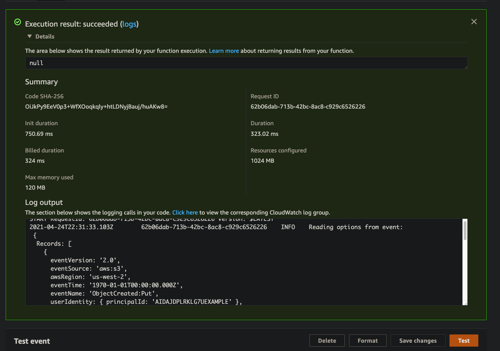
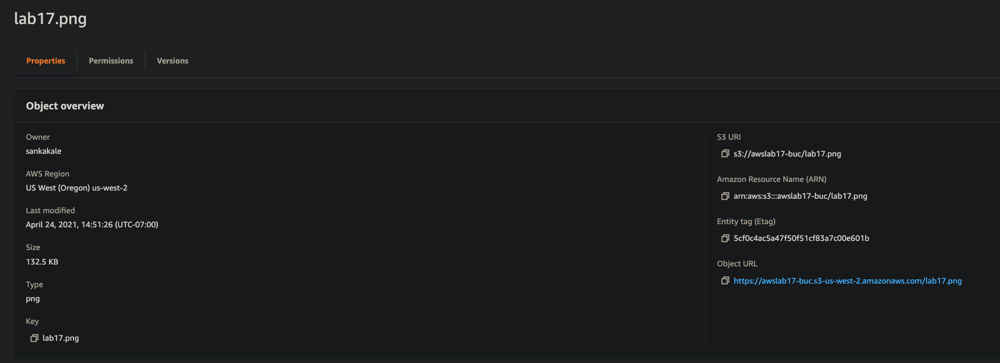
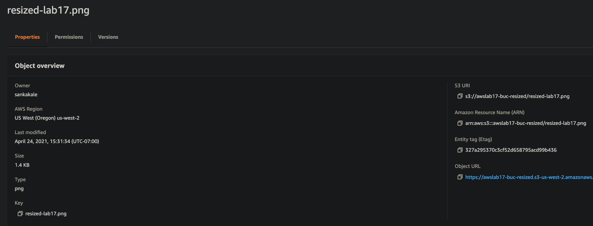

# LAB - 17

## Project: AWS: S3 and Lambda

### Author: Kale Lesko

### Links and Resources

- [ci/cd](https://github.com/Saynka/image-lambda/actions) (GitHub Actions)
<!-- - [back-end server url](http://xyz.com) (when applicable)
- [front-end application](http://xyz.com) (when applicable) -->

### Setup

- no idea good luck
- https://docs.aws.amazon.com/lambda/latest/dg/with-s3-tutorial.html

#### `.env` requirements (where applicable)

- `aws-sdk`
- `sharp`
- `util`

#### How to initialize/run your application (where applicable)

- no idea it works tho

#### How to use your library (where applicable)

#### Tests

- How do you run tests?
- Any tests of note?
- Describe any tests that you did not complete, skipped, etc

#### UML

